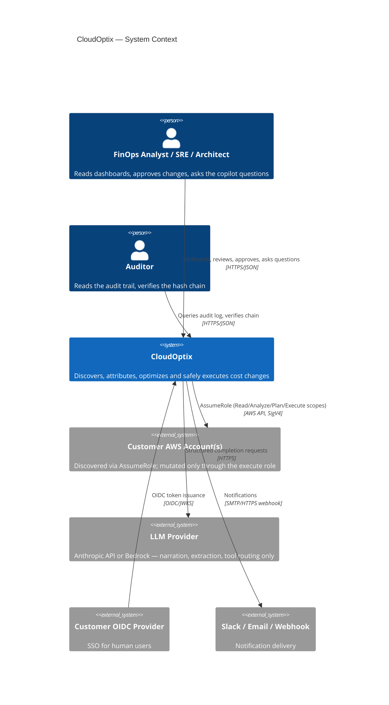
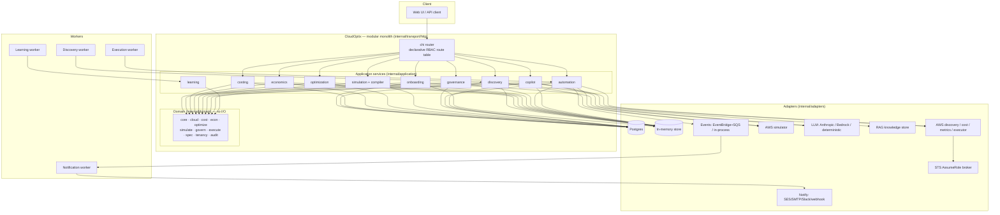
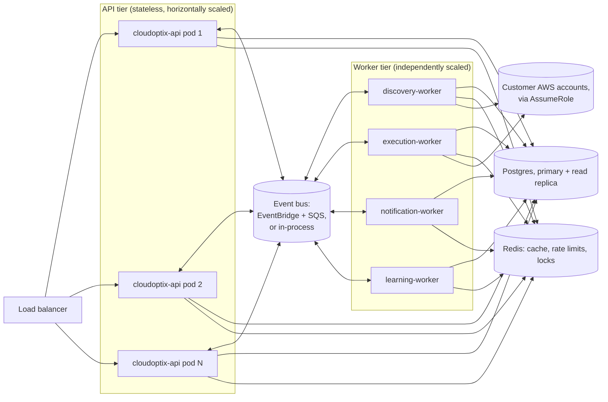
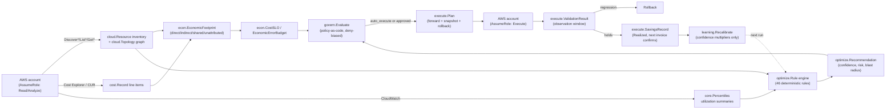
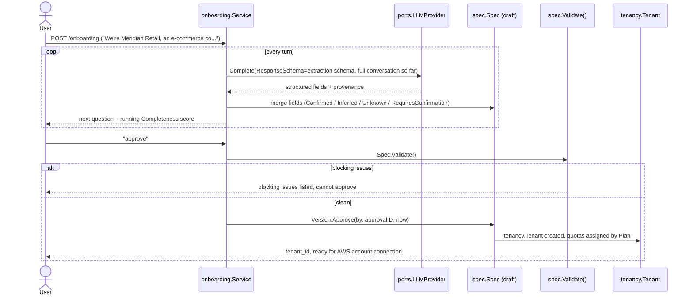
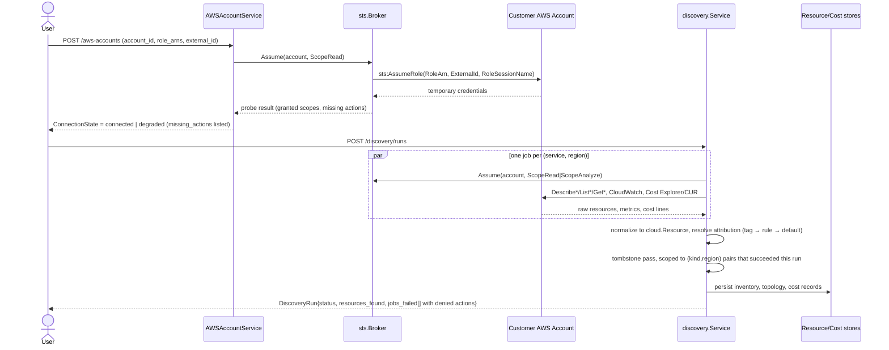
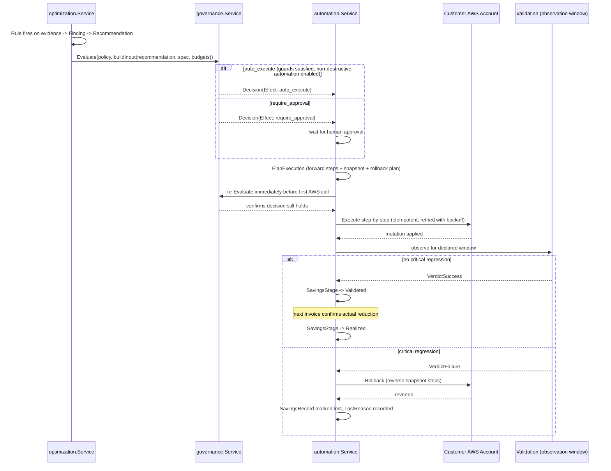
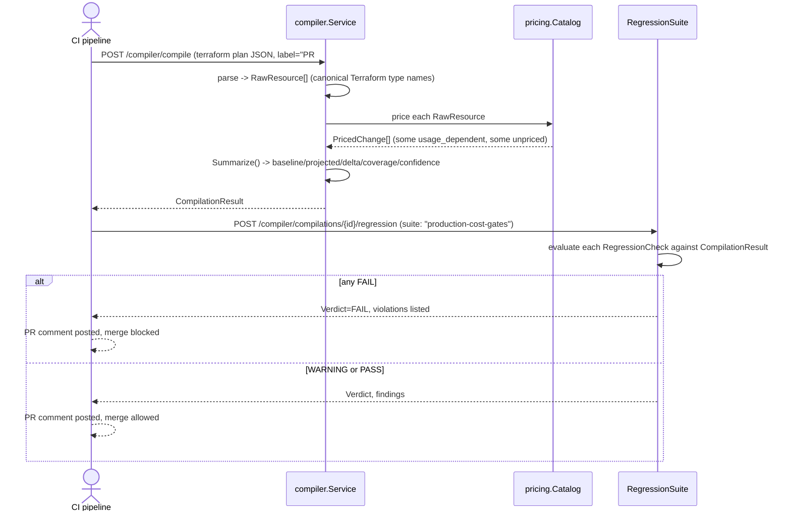

# CloudOptix

CloudOptix is a cloud economics platform for AWS: it discovers an estate, attributes every dollar to the business capability, transaction and architectural decision that caused it, decides — with deterministic, auditable logic — what would cost less, prices a change before it ships, and executes the change through a policy engine that a large language model cannot talk its way around. It is built as a modular monolith in Go, with every AWS mutation reachable only through `sts:AssumeRole` into a customer-scoped IAM role, never a stored credential. Where the code partially implements something, this document says so; where a directory is scaffolding and not yet wired up, this document says that too.

This is a from-scratch, single-tenant-of-one-engineer build. It has not run against a real AWS account, has no deployment pipeline, and has no external users. Read it as a serious architectural prototype with a genuinely novel cost model, not as a production claim.

## Table of contents

- [Why traditional FinOps tooling is insufficient](#why-traditional-finops-tooling-is-insufficient)
- [Architecture Economics](#architecture-economics)
- [Differentiators](#differentiators)
- [The AI safety model](#the-ai-safety-model)
- [Architecture](#architecture)
- [Sequence diagrams](#sequence-diagrams)
- [Security model](#security-model)
- [Example onboarding conversation](#example-onboarding-conversation)
- [Example specification](#example-specification)
- [Example dashboard](#example-dashboard)
- [Example optimization workflow, end to end](#example-optimization-workflow-end-to-end)
- [Quick start](#quick-start)
- [Repository layout](#repository-layout)
- [Architecture principles](#architecture-principles)
- [Current limitations and what production hardening would still require](#current-limitations-and-what-production-hardening-would-still-require)

## Why traditional FinOps tooling is insufficient

Every mainstream FinOps tool — Cost Explorer, a CUR dashboard, a third-party cost-visibility SaaS — answers the same question well: *what did each AWS service cost, broken down by tag, over some past period?* That is a real, necessary capability, and CloudOptix ingests the same Cost & Usage Report data these tools do (see `internal/application/costing`). It is also a narrow slice of what an engineering organization actually needs to decide anything:

| Question | What a billing dashboard answers | What it cannot answer |
|---|---|---|
| What did RDS cost last month? | "$24,500." | Nothing about who caused it. |
| What does the checkout capability cost? | Nothing — "checkout" is not a billing dimension. | Requires walking the architecture graph, not the invoice. |
| What does one checkout transaction cost? | Nothing — there is no per-transaction line item in a CUR file. | Requires a business denominator the platform has to track as a first-class object. |
| Which architectural decision created this cost? | Nothing — a tag tells you *what*, never *why*. | Requires knowing that this NAT gateway exists because that team chose not to use a VPC endpoint. |
| What will this Terraform change cost before it merges? | Nothing — the invoice only exists after the resource has billed for a month. | Requires pricing IaC against a catalog before `apply`. |
| Did last month's "rightsizing win" actually show up on the bill? | Nothing — most tools report the recommendation, not what happened after. | Requires tracking a saving through execution, validation and the next invoice. |

A billing tool is a rear-view mirror pointed at the invoice. Everything CloudOptix adds sits on top of the same billing data and answers the questions a rear-view mirror structurally cannot: attribution along the *architecture*, not the tag; a *transaction* as a first-class unit of cost; a price *before* the change ships, not after; and a savings claim that is only allowed to call itself real once the bill confirms it (see the six-stage savings ladder in [Autonomous Optimization](#differentiators)). This is not a criticism of Cost Explorer or the CUR — CloudOptix's own costing engine is built directly on both — it is a description of where the category stops and where this platform starts.

## Architecture Economics

Architecture Economics (`internal/domain/econ`, `internal/application/economics`) is CloudOptix's core differentiator: cost attributed along the resource-dependency graph, not the tag that happens to be on an invoice line, decomposed into three classes.

- **Direct** (`econ.ClassDirect`) — spend on resources a scope exclusively owns: its own compute, its own database.
- **Indirect** (`econ.ClassIndirect`) — spend the scope demonstrably *caused* on a resource it does not own, with exactly one consumer: NAT data-processing charges for its own egress, cross-AZ transfer between its own replicas, load-balancer LCU consumption driven by its own traffic.
- **Shared** (`econ.ClassShared`) — spend on a resource with more than one measured consumer, split by each consumer's share of `cloud.Topology.Consumers`: an observability platform, a shared EKS control plane, a shared cache.

Any structural dependency (a `depends_on` or `routes_to` edge) for which no consumer edge was ever recorded is **not** guessed at with an even split. It is added to the scope's `Unattributed` remainder and shown, in full, as unattributed — the `internal/domain/econ` package doc is explicit about why: an even split "would tell a team 'your database costs you $340/month' when the true number could be $50 or $900 depending on a traffic pattern nobody measured," and a confident wrong number is worse for a FinOps decision than an honest "we don't know yet."

### Worked example: the checkout capability

This is the example `internal/domain/econ/footprint.go`'s own package documentation uses to explain the model, reproduced here with the fuller breakdown:

> A billing tool answers "Amazon RDS cost $24,500 last month." Architecture Economics answers "the checkout capability cost $61,200 last month, of which $24,500 was its database, $8,700 was NAT egress it caused, and $4,100 was its measured share of the shared observability platform — $0.0061 per checkout, up 14% because the p95 basket size grew, not because anything got more expensive per unit."

Decomposed against 10,000,000 checkout transactions that month (`spec.TransactionSpec{Name: "checkout", MonthlyVolume: 10000000}`):

| Class | Component | Monthly cost |
|---|---|---:|
| Direct | Aurora PostgreSQL cluster (writer + reader) | $24,500 |
| Direct | Fargate services + Lambda (`checkout-webhook`, `cart-abandonment-job`) | $15,700 |
| Direct | Application Load Balancer (`shopfleet-checkout-alb`) | $2,100 |
| Direct | API Gateway (REST) | $1,800 |
| Direct | DynamoDB (`shopfleet-cart-events-provisioned`) | $2,900 |
| Direct | SQS + SNS (checkout DLQ, payment events) | $800 |
| Direct | Attributable share of Secrets Manager / KMS | $600 |
| **Direct subtotal** | | **$48,400** |
| Indirect | NAT data processing caused by checkout's outbound calls (measured share of `nat-us-east-1a`/`b`) | $8,700 |
| Shared | Measured share of the shared observability/logging platform | $4,100 |
| **Total** | | **$61,200** |
| | **Cost per transaction** ($61,200 / 10,000,000) | **$0.00612** |

The direct-subtotal breakdown above is an illustrative decomposition built for this document (the source doc comment states only the $61,200/$24,500/$8,700/$4,100 headline figures); the component *shapes* — an Aurora writer+reader pair, a checkout ALB, a REST API Gateway, a provisioned-capacity DynamoDB table — are the actual `checkout-api`-tagged resources in the demo estate (`internal/adapters/awssim`), and their real, simulator-computed costs are lower than the headline figures above because the illustrative example describes a materially larger estate than the ~$186K/month demo tenant. Running the demo estate itself (`go test ./internal/adapters/awssim/... -run TestBuildDemoEstate -v`) prices those specific `checkout-api` resources at: Aurora writer $338.62/mo, Aurora reader $338.62/mo, `checkout-webhook` Lambda $210.76/mo, `cart-abandonment-job` Lambda $0.29/mo, ALB $80.67/mo, REST API Gateway $70.00/mo, SNS `payment-events` $2.00/mo, SQS `checkout-dlq` $0.08/mo.

That last detail matters for a reason beyond cost: in this run of the demo estate's seeded random-tag generator, `checkout-webhook`, `shopfleet-cart-events-provisioned` and `shopfleet-checkout-dlq` came up **with no `Application` tag at all** — the exact "incomplete tagging" failure mode Architecture Economics is built to survive. Discovery's attribution algorithm (`internal/application/discovery`, decision 4 in its package doc) resolves attribution from three sources in trust order — a recognised tag, an `AttributionRule` matched by name pattern, then the account's declared environment as the weakest fallback — and records `core.ProvenanceInferred` rather than `ProvenanceConfirmed` on the result. A reviewer looking at the twin sees these three resources costed and attributed to `checkout-api`, but visibly marked "inferred from name pattern," not silently treated as equally certain as the ones that were actually tagged.

## Differentiators

### Architecture Digital Twin

`internal/application/twin` renders the discovered estate — resources, relationships, attributed cost, metrics, findings — as one graph a human can look at, projected through different **views** (cost, reliability, utilization) that pick which numeric fields drive node size and colour without changing the underlying graph shape. `CostFlow`'s accumulation is built so conservation is provable by construction: every resource's own cost is injected exactly once at its own node, an edge only ever redistributes a fraction already received, and the un-redistributed remainder stays on that node — so summing every displayed node cost, at any collapse level, always equals the sum of the resources' own billed cost. Collapsing a subgraph into one synthetic node is safe for the same reason: the collapsed node satisfies the identical `TwinNode` shape, so nothing downstream needs a special case for it.

### Cost SLOs and the Economic Error Budget

`internal/domain/econ/slo.go` applies SRE's error-budget discipline to spend. A `CostSLO` (e.g. "checkout ≤ $0.02/transaction," "production infrastructure ≤ $100K/month") carries an `ErrorBudgetPct` — the tolerated variance above target — and `EvaluateBudget` computes, for the current window: consumption pro-rated against elapsed time (so a month-to-date comparison against a full-month target doesn't read healthy until the 28th), a **burn rate** (consumption pace ÷ elapsed pace — `1.0` lands exactly at zero on the last day, `2.0` burns the whole budget in half the window), a projected end-of-window position, and — when the burn rate exceeds 1 — a projected exhaustion date. `BudgetState` moves through `healthy → watch (≥50%) → at_risk (≥75%) → exhausted (≥100%) → breached (target itself exceeded)`.

The declared breach response is what makes the budget more than a chart: a `CostSLO` names its `BreachActions` in advance — `notify`, `require_approval` (escalate every cost-increasing change to human approval, even ones policy would normally auto-approve), `freeze_cost_increases` (refuse cost-increasing changes outright), `generate_recommendations`, `open_investigation`. `EconomicErrorBudget.AllowsCostIncrease()` is consulted directly by the governance engine (`govern.Input.BudgetFreeze`/`BudgetRequiresApproval`) — an exhausted budget with a freeze action is a hard `prohibit` on any cost-increasing change, applied as a platform invariant no policy rule can override.

### The Cost Compiler

`internal/application/compiler` prices infrastructure changes before they deploy — from Terraform plan JSON, raw HCL, CloudFormation, Kubernetes manifests and Helm output — by normalizing every dialect into one intermediate shape (`RawResource`, keyed by the Terraform provider type name, since that is the most complete AWS vocabulary already in wide use) and running it through the pricing catalog. The one rule the whole package exists to uphold, stated on `simulate.PricedChange` itself: **"unpriced" and "free" are different answers.** A gateway VPC endpoint that genuinely costs nothing produces `AfterMonthly: $0, Unpriced: false`; an MSK cluster the catalog has no data for produces `Unpriced: true` with a stated reason — never a fabricated number, never a silent zero. A resource whose cost depends on usage the compiler cannot observe (Lambda invocations, NAT bytes, S3 storage growth) is priced as usage-dependent with the assumed usage stated and overridable, and `CompilationResult.Coverage`/`Confidence` are discounted by how much of the projected delta is that kind of modelling rather than fixed catalog pricing. See [`examples/cost-compiler/`](examples/cost-compiler/) for a full passing and failing CI run.

### The Architecture Mutation Engine and the Counterfactual Engine

`internal/application/simulation` and `internal/domain/simulate` implement two forward-looking engines against the tenant's own stored `Inventory` and `Topology`: the **Mutation Engine** generates candidate architectures (move a workload to Fargate, add a read replica, switch a queue for a Kinesis stream) and scores each on eight independent dimensions — cost, performance, reliability, scalability, security, operational complexity, migration effort, risk — deliberately not cost alone, because "an architecture that is 40% cheaper and one SPOF worse is not an improvement, and a tool that only ranks by cost will keep recommending it" (package doc). The **Counterfactual Engine** answers "what if" against the same inventory: what does Black Friday traffic cost at 5x load, what does removing the NAT gateways cost, what does a different commitment posture cost. Every number either engine produces is a model, not a measurement — every input the engine could not observe (an assumed invocation rate, an assumed cache hit rate) travels as a stated, overridable `simulate.Assumption` with its own confidence and sensitivity, the same discipline the compiler follows.

### The AI Cost Copilot

`internal/application/copilot` answers questions about spend, waste, unit economics and optimization opportunities by calling a **fixed, read-only tool registry** and composing the answer from what the tools actually returned — see [The AI safety model](#the-ai-safety-model) for why every tool is structurally incapable of writing anything. Before an answer is returned it passes a `GroundingVerifier`: every resource id, account id and dollar figure in the text is checked against what the tools returned this conversation; an ungrounded answer is regenerated once, and if still ungrounded, returned with an explicit caveat rather than presented as fact. See [`examples/copilot/`](examples/copilot/) for worked questions and their grounded answers with citations.

### Autonomous Optimization and the six-stage savings ladder

`internal/application/optimization` is a deterministic rule engine (48 rules across compute, storage, database, network, serverless, Kubernetes, observability and commitment — see `rules/`) that separates three things a naive cost tool conflates into one opaque score: a **Rule** fires on evidence and produces a **Finding**, a statement of fact, never a recommendation, and two runs against the same inputs always produce the same findings in the same order; **confidence, blast radius and risk** are each computed by an independently testable, from-structured-facts function — never an LLM's self-assessment (see [`internal/application/optimization/confidence.go`](internal/application/optimization/confidence.go)'s doc comment on why an LLM asked "how confident are you" answers from its training distribution of confident-sounding text, uncorrelated with whether the telemetry supports the claim); and the **Registry** (loaded from versioned YAML in `rules/`) owns which rules run at what threshold, so a threshold change is a config diff, not a code deploy.

Most cost tools report one number, "potential savings," and stop — a marketing figure that assumes every recommendation is approved, executed perfectly, and holds. `internal/domain/execute/savings.go` tracks all six rungs of the ladder instead:

```
potential → approved → planned → executed → validated → realized
```

`StageRealized` — "this is the only figure CloudOptix will put in front of a CFO" (package doc) — is set only once billing data *after* the change confirms the reduction; a rollback at any stage marks the record `lost` with a reason rather than silently disappearing, which is what keeps the funnel's conversion rate an operational number instead of a marketing one. See [`examples/optimization-scenarios/`](examples/optimization-scenarios/) for full walk-throughs, including one that gets rolled back.

### Blast Radius

`internal/application/optimization/blast.go` computes `optimize.BlastRadius` by walking the actual dependency graph (`cloud.Topology.Dependents`, up to depth 6) — never by estimation — into resource/service/critical-service counts and a `Completeness` figure that keeps a blast radius computed on a thin graph from ever reading as a small one: an under-observed dependency graph produces a *lower completeness score*, not a falsely reassuring low blast radius.

### Spec-driven onboarding

Everything downstream — discovery scope, policy defaults, automation posture, cost SLOs — is configured from one versioned artefact, `spec.Spec` (`internal/domain/spec`), produced by a conversational agent but never mutated by it directly. See [Example onboarding conversation](#example-onboarding-conversation) and [Example specification](#example-specification) below.

## The AI safety model

Stated bluntly, because it is the property a reviewer granting an IAM role actually needs to trust:

```
user → LLM → structured recommendation → deterministic validator → policy engine → risk engine → approval → execution engine → AWS
```

The LLM is never in the mutation path, and that is not a policy CloudOptix promises to follow — it is a shape several independent layers of the code cannot express otherwise:

1. **A read-only tool registry, enforced structurally, not by convention.** Every `ports.Tool` the copilot registers declares `ToolDefinition.ReadOnly: true`, and `Register` refuses — at registration time, not call time — anything that claims otherwise (`internal/application/copilot/doc.go`). There is no copilot tool that writes a resource, approves a recommendation, or changes a policy.
2. **A grounding verifier on every answer.** Every resource id, account id and dollar figure the model states is checked against the tool results actually returned in that conversation; an answer that references something ungrounded is regenerated once, then returned with an explicit caveat rather than as fact (`internal/application/copilot/grounding.go`).
3. **Structured extraction, never prose parsing, in onboarding.** Every onboarding turn builds a JSON Schema from the fields the agent still needs and calls `ports.LLMProvider.Complete` with `ResponseSchema` set — the answer is always a structured object the same interpreter applies whether it came from regex slot-filling (the deterministic provider) or a real model's forced tool-use output. A specification stays `spec.StatusDraft`, mutable and non-authoritative, until a human calls `Approve` — and `Approve` runs `spec.Validate()` first and refuses to proceed over any blocking issue. Nothing about a draft can create a tenant, grant AWS access, or configure automation.
4. **Policy-as-code with no I/O and no model in it.** `govern.Evaluate(policy, input)` is a pure function — no clock reads, no repository calls, no prose in or out — so a decision is reproducible from its inputs alone, months later, during an audit. Deny-bias governs it: among matching rules, the *most restrictive* effect wins regardless of file order (`prohibit` > `require_approval` > `advisory_only` > `auto_execute`), and an unmatched action falls to `default_effect`, which validation refuses to let any tenant set to `auto_execute`.
5. **The destructive-action guard, which no policy can override.** `govern.Policy.Validate()` refuses to save a policy that gives `auto_execute` to a destructive action (`optimize.ActionType.Destructive()`), that sets `default_effect: auto_execute`, that writes an `auto_execute` rule with no named scope at all, or that reaches production with `auto_execute` below `min_confidence: 0.85`. These four checks are blocking `SeverityCritical`/`SeverityHigh` validation issues — a policy that trips one cannot be saved, not merely warned about. On top of that, `govern.Evaluate` itself re-applies platform invariants *after* every tenant rule has been evaluated: a destructive action or a tenant with automation disabled is force-downgraded from `auto_execute` to `require_approval` regardless of what matched, and an exhausted economic error budget hard-`prohibit`s any cost-increasing change.
6. **A four-phase execution discipline with the rollback plan built first.** `internal/application/automation`'s `Plan → Execute → Validate → Rollback` are separate, independently auditable calls. `execute.Plan.Executable` requires a non-nil `Rollback` and refuses a plan that mutates without a preceding snapshot step — enforced a second time at the orchestration layer, on top of the domain type, because "CloudOptix never makes a change it cannot undo, or at minimum cannot honestly describe as undoable" must not depend on every future executor implementation remembering to preserve it. `Execute` re-checks governance a second time immediately before the first AWS call — a plan approved hours ago is re-validated against the current maintenance window, error budget and freeze state, not trusted on stale state.
7. **The learning loop cannot rewrite what it is allowed to do.** `internal/application/learning` reads `execute.Outcome` and writes only confidence-calibration multipliers and searchable RAG history — it never reads or writes a `govern.Policy`, an `optimize.Rule`, a `spec.Spec`, or a `ValidationCheck`. A system whose own outcomes can rewrite the rules that decide what it is allowed to do next has closed a loop a human is supposed to be standing in.

**A verified, honest caveat on point 5.** `policies/README.md` documents, at length, a domain-layer bug it claims makes `auto_execute` mathematically unreachable from any validated policy (the rule-selection fold allegedly could only ever escalate toward *more* restrictive effects). Reading `internal/domain/govern/policy.go`'s current `Evaluate` function shows that fold has already been rewritten to track the most-restrictive *matching* rule's effect independently of the seeded default (see the comment beginning "Deny-bias operates *among the matching rules*" at policy.go:333), and a direct test against the shipped `balanced.yaml` confirms `auto_execute` **is** reachable today — a waste finding matching `balanced.waste.non-production.auto` with every guard satisfied resolves to `Effect: auto_execute`, `DecidingRule: balanced.waste.non-production.auto`. `policies/README.md` was not updated after that fix landed and is stale; the code, not that doc, is ground truth. This is called out explicitly because the AI safety model above depends on the destructive-action guard and deny-bias actually working, and "verified by running the code, not by reading a stale comment" is exactly the standard this document tries to hold every other claim to.

## Architecture

### System context



### Container / component view



### Deployment: modular monolith + workers

CloudOptix ships as one Go binary — every application service in one process, behind one `chi` router — plus a small number of background workers that consume the same event bus rather than separate microservices. This is a deliberate choice (see [`docs/adr/0001-modular-monolith.md`](docs/adr/0001-modular-monolith.md)): the engines are tightly coupled by data (discovery feeds cost attribution feeds optimization feeds governance feeds execution) and a network hop between them buys nothing but latency and a new failure mode, at this stage of the product. What *is* split out are the workloads that are naturally asynchronous and benefit from independent scaling and backpressure:



Every application service is reachable identically from an API-tier request or a worker's event handler, because both call the same `ports.Services` bundle — the split is purely about where a process runs, not about a different code path for "the safe way" versus "the fast way."

### Data flow: discovery → attribution → recommendation → execution



## Sequence diagrams

### Conversational onboarding through to tenant creation



### AWS account connection and discovery



### Recommendation → realized savings, with a rollback path



### Cost Compiler run in CI



## Security model

**AssumeRole with external ID, nothing else.** `internal/adapters/aws/sts` has no function, constructor option or struct field anywhere that accepts an AWS access key ID or secret access key — a reviewer can verify "no static keys ever touch a customer account" by grepping the package for `AccessKeyId`/`SecretAccessKey` as an input parameter and finding none. Every credential CloudOptix ever holds for a customer account is minted by `sts:AssumeRole` against CloudOptix's own control-plane identity (an ECS task role, an EC2 instance profile), and every `AssumeRole` call carries the account's `ExternalID` — generated by CloudOptix, unique per account, required in the customer's trust policy — as the confused-deputy defence: without it, a customer's trust policy could be assumed by any CloudOptix tenant, not just the one it was written for. `RoleSessionName` is built from the CloudOptix principal and the requesting scope, so the customer's own CloudTrail attributes every action to a specific session, not to an anonymous `AssumeRole` line.

**Four permission scopes, four separate IAM roles.** `cloud.RoleScope`: `read` (`Describe*/List*/Get*` on inventory), `analyze` (CloudWatch, Cost Explorer, CUR), `plan` (dry-run/simulate APIs only), `execute` (the narrow mutating set, per action type). These are distinct roles a tenant creates in their own account, not four permission checks against one wide role — a tenant that never creates the execute role has no code path that can obtain an execute-scoped session (`Broker.Assume` fails the same way a real `AssumeRole` against a nonexistent role would).

**Tenant isolation at every layer, not just the API.** `core.TenantID` is a distinct type carried by every repository method, cache key and event, so a missing or swapped tenant scope is a compile error, not a runtime hope. `core.GuardTenant` is structural inside every `memstore` repository method — not a convention call sites are trusted to apply — and the RAG knowledge store's `Search` takes no tenant-filter *parameter to forget*: every query is structurally intersected with (platform-wide documents) ∪ (the querying tenant's own documents) before ranking runs, because there is no filter argument to omit.

**RBAC.** Nine roles (`core.Role`), permissions resolved by table lookup (`rolePermissions`), never stored per-user, so a policy change applies immediately and uniformly:

| Role | Can execute / roll back changes | Can approve | Notes |
|---|---|---|---|
| `platform_admin` | No (structurally excluded — see `Principal.Can`) | No | CloudOptix operators; read anything for support, cannot push a customer's change |
| `tenant_admin` | Yes | Yes | Full tenant control including policy and automation config |
| `architect` | No | No | Spec authoring, simulation, compiler |
| `finops_analyst` | No | No | Read + simulation + SLO authoring |
| `sre` | Yes | No | Discovery, execution, rollback |
| `developer` | No | No | Compiler + simulation only |
| `auditor` | No | No | Read-everything including the audit log; cannot change anything |
| `viewer` | No | No | Read-only bundle |
| `system` | Yes | No | Internal workers (`core.SystemPrincipal`), never issued to a human |

The one property worth stating plainly: an auditor whose credentials are stolen cannot move money. `platform_admin` is explicitly carved out of `PermExecutionStart`/`PermRollbackStart` in `Principal.Can` — CloudOptix's own operators can read a tenant's data for support but cannot themselves push a tenant's infrastructure change; that has to come from the tenant.

**Every route double-checks its own permission.** Authorization is a declarative table (`internal/transport/http/routes.go`, 103 authenticated operations + 8 public onboarding operations), each entry naming its `core.Permission`, tested by `routes_test.go` asserting every mutating route carries a non-empty permission. Handlers still re-check the identical permission via `core.Principal.Authorize` before touching a service — not because the router might wrap it wrong, but because a handler reachable by a path the router doesn't know about (a future refactor, a mistake in `Mount`) must fail closed on its own. No handler holds a repository directly; every handler is constructed with only the `ports.Services` bundle, so the only way to reach persistence is through an application service that has already applied the tenant guard, business rules and audit trail.

**The audit hash chain.** `internal/domain/audit` hash-chains every consequential record: each record stores the SHA-256 hash of its predecessor for the same tenant, so removing or editing a record breaks the chain at every subsequent entry, detectable in one verification pass (`audit.VerifyChain`). This does not make the log immutable — nothing in a mutable database is — but it makes tampering *detectable*, and in a production deployment records are additionally written to object storage with a retention lock for actual immutability.

## Example onboarding conversation

A realistic transcript with Meridian Retail (a mid-market e-commerce company), showing provenance markers, a user saying "I don't know," and a mid-conversation SLO change:

> **CloudOptix:** Hi — I'll help you set up CloudOptix. What's your company called, and what does the business do?
>
> **User:** We're Meridian Retail. Mid-size e-commerce, mostly apparel. About 40 people in engineering.
>
> **CloudOptix:** Got it. `organization.name = "Meridian Retail"` **[CONFIRMED]**, `organization.industry = "e-commerce/retail"` **[CONFIRMED]**. Based on a 40-person engineering org, I'll tentatively size you as `organization.size = "mid-market"` **[INFERRED — rationale: "40 engineers is consistent with a mid-market classification (50-500 employees) rather than enterprise; confirm if company headcount differs materially from engineering headcount"]**. Does that sound right, or is total headcount larger?
>
> **User:** Total headcount is about 300, so yeah mid-market is fine. We run everything on AWS in us-east-1, one account for now.
>
> **CloudOptix:** `aws.accounts[0].regions = ["us-east-1"]` **[CONFIRMED]**. I'll need the account ID and a role ARN once you're ready to connect — we can do that after the spec is drafted. What does your architecture look like — microservices, a monolith, something else?
>
> **User:** Mostly microservices on ECS Fargate, Postgres via RDS, Redis for sessions. Honestly I don't know our exact deployment model — we've got three teams and I'm not sure they all deploy the same way.
>
> **CloudOptix:** That's fine, we'll leave `application.architecture.deploymentModel` **[UNKNOWN]** and discovery can often infer it from what's actually running (mixed deployment models show up as a finding, not a blocker). `application.architecture.style = "microservices"` **[CONFIRMED]**, `computePlatforms = ["ecs_fargate"]` **[CONFIRMED]**, `databases = ["rds_postgres"]` **[CONFIRMED]**, `caches = ["redis"]` **[CONFIRMED]**. Let's talk about what matters commercially — do you have a checkout or order-placement flow you'd want to track cost against specifically?
>
> **User:** Yes, checkout is the big one — we do around 10 million checkouts a month. We'd like checkout cost to stay under two cents each, we've been burned by cost creep there before.
>
> **CloudOptix:** `business.transactions[0] = {name: "checkout", monthlyVolume: 10000000}` **[CONFIRMED]**, and I'll set a Cost SLO: `objectives.costSlos[0] = {name: "checkout-unit-cost", kind: "cost_per_transaction", transaction: "checkout", target: 0.02, window: "calendar_month"}` **[CONFIRMED]**. What should happen if that budget is at risk of being blown — just an alert, or something stronger?
>
> **User:** Alert first, and if it actually breaches, freeze anything that would make it worse.
>
> **CloudOptix:** `breachActions = ["notify", "freeze_cost_increases"]` **[CONFIRMED]**. One more on risk appetite: how comfortable are you with CloudOptix making changes automatically, versus asking every time?
>
> **User:** Let's start conservative. Nothing auto-executes, everyone approves everything, even in staging.
>
> **CloudOptix:** `optimization.riskTolerance = "low"` **[CONFIRMED]**, `automation.enabled = false` **[CONFIRMED]**, policy pack set to `conservative`. Actually — before we finish, want to revisit the checkout target? A lot of teams start at 2 cents and find it's tighter than their actual architecture supports once discovery runs.
>
> **User:** Good call, let's loosen it to 2.5 cents for now and we'll tighten it once we've seen real numbers.
>
> **CloudOptix:** Updated: `objectives.costSlos[0].target = 0.025` **[CONFIRMED — supersedes prior value]**. That's everything I need to draft a complete specification. Completeness: 78% (2 fields need your confirmation, 1 is intentionally unknown pending discovery). Ready to review?

## Example specification

The `cloudoptix.yaml` this conversation produces (abbreviated to the fields discussed above — the full reference specification with every section populated is [`specs/v1/cloudoptix.yaml`](specs/v1/cloudoptix.yaml)):

```yaml
apiVersion: cloudoptix.io/v1
kind: CloudOptixSpec

organization:
  name: Meridian Retail
  industry: e-commerce/retail
  size: mid-market

application:
  name: meridian-storefront
  domain: e-commerce
  architecture:
    style: microservices
    computePlatforms: [ecs_fargate]
    databases: [rds_postgres]
    caches: [redis]
    deploymentModel: ""   # UNKNOWN — pending discovery

aws:
  accessMode: assume_role
  accounts:
    - id: "PENDING"       # captured at AWS account connection, not in this conversation
      environment: production
      regions: [us-east-1]
      production: true

business:
  transactions:
    - name: checkout
      monthlyVolume: 10000000
      critical: true

objectives:
  costSlos:
    - name: checkout-unit-cost
      kind: cost_per_transaction
      transaction: checkout
      target: 0.025
      window: calendar_month
      errorBudgetPct: 0.05
      breachActions: [notify, freeze_cost_increases]

optimization:
  riskTolerance: low
  spotAllowed: false

automation:
  enabled: false

governance:
  productionChangesRequireApproval: true
  policyPack: conservative
```

The full provenance map (`Spec.Provenance`, kept alongside the YAML rather than inline in it, so the file a customer commits to git stays clean) for this excerpt:

| Path | Provenance | Source |
|---|---|---|
| `organization.name` | CONFIRMED | user |
| `organization.industry` | CONFIRMED | user |
| `organization.size` | CONFIRMED | user (overrode the agent's initial INFERRED value) |
| `application.architecture.style` | CONFIRMED | user |
| `application.architecture.deploymentModel` | UNKNOWN | user said they didn't know |
| `business.transactions[0].monthlyVolume` | CONFIRMED | user |
| `objectives.costSlos[0].target` | CONFIRMED | user (revised mid-conversation from 0.02 to 0.025) |
| `optimization.riskTolerance` | CONFIRMED | user |
| `automation.enabled` | CONFIRMED | user |

## Example dashboard

```
┌─ CloudOptix — shopfleet-prod ────────────────────────────────────── Aug 2026 ─┐
│                                                                                │
│  Monthly spend            Identified waste          Efficiency Score          │
│  $185,978.41               $44,206.84 (23.8%)             62  (D)             │
│  ▲ 3.1% vs last month      ▼ 8.4% vs last month        ▲ 4 pts vs last month   │
│                                                                                │
│  Cost SLO: checkout ≤ $0.025/txn ─────────────────────────────  WATCH (58%)   │
│  ██████████████████████████░░░░░░░░░░░░░░░░  burn rate 1.4x                   │
│  Projected exhaustion: Sep 21  (11 days before window close)                  │
│                                                                                │
│  Waste by category (monthly)                                                  │
│  EKS pod/node overprovisioning   ████████████████████████████  $20,034.12     │
│  NAT processing w/o VPC endpoint ██████████████████             $12,348.00    │
│  Old RDS read replica (unused)   ███                             $3,791.82    │
│  Aged EBS snapshots               ███                            $3,100.50    │
│  Oversized RDS primary            ██                             $2,189.74    │
│  gp2 volumes → gp3                                                 $405.14    │
│  Lambda over-provisioning                                          $236.47    │
│  S3 lifecycle (multipart/versions)                                 $328.25    │
│  Unattached EBS volumes                                            $681.60    │
│  Stopped-instance orphan volumes                                   $176.00    │
│  Oversized EC2 (chronic idle)                                      $845.49    │
│  Old-generation EC2                                                 $36.87    │
│  Unattached Elastic IPs                                             $32.85    │
│                                                                                │
│  Savings funnel (trailing 90 days)                                            │
│  potential  ████████████████████████████████████████  128 recs  $61,400/mo   │
│  approved   ████████████████████████████████░░░░░░░░   94 recs  $44,900/mo   │
│  planned    ████████████████████████████░░░░░░░░░░░░   88 recs  $41,200/mo   │
│  executed   ██████████████████████████░░░░░░░░░░░░░░   81 recs  $37,600/mo   │
│  validated  ████████████████████████░░░░░░░░░░░░░░░░   76 recs  $34,900/mo   │
│  realized   ██████████████████████░░░░░░░░░░░░░░░░░░   71 recs  $31,800/mo   │
│                                                                                │
│  Recent findings                                                              │
│   HIGH   EKS nodegroup shopfleet-eks-general packed at 35% (130 desired)      │
│   HIGH   3 NAT gateways carrying S3-bound traffic, no VPC endpoint            │
│   MED    RDS read replica shopfleet-orders-primary-replica, no consumer       │
│   MED    560 EBS snapshots older than 365-day retention policy                │
│   LOW    35 gp2 volumes priced above their gp3 equivalent                     │
└────────────────────────────────────────────────────────────────────────────┘
```

The spend, waste and burn-rate figures above are real: verified by running `go test ./internal/adapters/awssim/... -run TestBuildDemoEstate -v` against this repository (total monthly cost logged as `$185978.41`, identifiable waste as `$44206.84`). The savings-funnel and findings-list figures are illustrative — they show the *shape* the funnel and findings feed take, not a captured run, since the platform has no wired-up entrypoint yet (see [Current limitations](#current-limitations-and-what-production-hardening-would-still-require)).

## Example optimization workflow, end to end

Using the demo estate's own numbers throughout (verified, not invented — see `internal/adapters/awssim/waste.go` and `demo_data.go`):

1. **Discovery.** `discovery.Service.Run` scans the `shopfleet-prod` account (simulated via `internal/adapters/awssim` for the demo tenant) and inventories 500+ resources across EC2, EBS, RDS, DynamoDB, S3, Lambda, ECS/Fargate, EKS, load balancing, CloudFront, API Gateway, ElastiCache, SQS/SNS, CloudWatch Logs, KMS and Secrets Manager. Total estate cost: **$185,978.41/month**.
2. **Rule evaluation.** The optimization engine's 48 rules fire against the discovered inventory and its utilization telemetry. The `ec2-underutilized-rightsize` rule (`rule_ec2_rightsize.go`) flags `checkout-api-worker-1` — an `r5.2xlarge` running at 5.8% P50 CPU over the observed window, tagged `Application: checkout-api`, `Team: payments`, `Environment: production`.
3. **Confidence, risk, blast radius.** `ComputeConfidence` scores the finding from metric stability, window coverage, dependency-graph completeness and resource age (not an LLM self-report). `ComputeBlastRadius` walks `cloud.Topology.Dependents` from the instance and finds it sits behind the checkout ALB target group, in the production critical path. `ComputeRiskAssessment` weighs the capacity-reducing nature of a resize against the workload's declared SLO headroom.
4. **The recommendation.** Two rungs down the family ladder — the platform's conservative "don't downsize in one jump" heuristic — the target is `r5.large`. On-demand pricing: `r5.2xlarge` at $0.252/hr ($183.96/month) → `r5.large` at $0.063/hr ($45.99/month). **Predicted saving: $137.97/month ($1,655.64/year).**
5. **Policy evaluation.** `govern.Evaluate` runs the recommendation against `balanced.yaml`: `categories: [rightsizing]` always requires approval under this pack, in every environment (`balanced.rightsizing.always-approval`) — rightsizing changes capacity rather than removing it, so a wrong estimate degrades performance under real load rather than merely costing a few minutes to reverse. `Decision.Effect = require_approval`, one approval required.
6. **Human approval, execution plan, execution.** An `sre` or `tenant_admin` approves. `automation.Service.PlanExecution` builds the forward step (resize), the snapshot step (capture current instance state), and the rollback plan (resize back) before anything runs. `Execute` re-checks governance one more time, then resizes the instance through the `execute`-scoped role, retrying transient AWS errors with idempotency-key-backed exponential backoff.
7. **Validation.** The observation window (a tenant-configured duration, e.g. 60 minutes) watches P95 latency, error rate and CPU headroom against baseline. If nothing regresses past its declared threshold: `VerdictSuccess`, `SavingsStage → Validated`.
8. **Realization.** The following month's ingested Cost & Usage Report shows the instance actually billing at the `r5.large` rate. Only then does `SavingsStage → Realized` — the number a CFO sees.

For the two largest waste categories in this same estate — where the savings are far larger and the story is different in kind — see the full worked scenarios in [`examples/optimization-scenarios/`](examples/optimization-scenarios/): **EKS pod/node overprovisioning ($20,034.12/month** across two node groups packed at 35–40%) and **NAT data processing with no VPC endpoint ($12,348.00/month**, 80% of it S3-bound traffic three gateways could stop paying to process). That directory also includes a rollback: an RDS downsize (`shopfleet-orders-primary`, `db.r5.8xlarge → db.r5.4xlarge`, predicted saving **$2,803.20/month**) that trips a critical p99-latency regression during its validation window and is reversed.

## Quick start

**There is currently no `cmd/` entrypoint in this repository — no `main.go` assembles `ports.Services` and mounts `internal/transport/http`'s router into a runnable binary.** Every piece needed to build one exists and is independently tested (`internal/adapters/memstore`, `internal/adapters/awssim`, `internal/adapters/llm/deterministic`, `internal/adapters/events.InProcess`, `internal/transport/http.NewRouter`, `internal/infrastructure/server.New`), but nothing wires them together into a process yet. This is stated explicitly in [Current limitations](#current-limitations-and-what-production-hardening-would-still-require) rather than glossed over. What follows is how the zero-infrastructure and full-stack configurations *would* be assembled from the pieces that exist today.

### Zero infrastructure (in-memory store, simulated AWS, deterministic LLM)

Every adapter needed to run the whole platform with no external dependency is already a first-class, independently tested implementation — not a mock (see [ADR-0007](docs/adr/0007-in-memory-adapters-as-first-class-runtime.md)):

```go
// Illustrative — not a file in this repository. Composing this into
// cmd/cloudoptix/main.go is exactly the gap Current Limitations describes.
package main

import (
    "log/slog"
    "net/http"

    "github.com/udaykishore-resu/cloudoptix/internal/adapters/awssim"
    "github.com/udaykishore-resu/cloudoptix/internal/adapters/events"
    "github.com/udaykishore-resu/cloudoptix/internal/adapters/llm/deterministic"
    "github.com/udaykishore-resu/cloudoptix/internal/adapters/memstore"
    httptransport "github.com/udaykishore-resu/cloudoptix/internal/transport/http"
    "github.com/udaykishore-resu/cloudoptix/internal/infrastructure/server"
)

func main() {
    store := memstore.NewStore()               // every repository port, one process, no DB
    bus := events.NewInProcess()                // in-memory pub/sub with retry + DLQ
    estate := awssim.BuildDemoEstate()          // the shopfleet-prod demo tenant: $185,978.41/mo
    llmProvider := deterministic.NewProvider()  // scripted, seeded, no API key

    svcs := wireServices(store, bus, estate, llmProvider) // application-layer composition — the gap
    router := httptransport.NewRouter(httptransport.Deps{Services: svcs}, nil)

    srv, _ := server.New(server.Config{Host: "0.0.0.0", Port: 8080}, router, slog.Default())
    srv.ListenAndServe()
}
```

Every adapter this snippet names is real and tested today: `go test ./internal/adapters/memstore/... ./internal/adapters/awssim/... ./internal/adapters/llm/deterministic/... ./internal/adapters/events/...`. The missing piece is `wireServices` — the application-layer composition root that constructs each of the fourteen `ports.Services` fields from these adapters. That is ordinary, mechanical Go code; it does not exist in this repository yet.

### Full stack

The same binary shape, with the production adapters instead: `internal/adapters/postgres` (behind the 13 migrations in `migrations/`) for persistence, `internal/adapters/aws/{discovery,costing,metrics,executor,sts}` against a real AWS account via `AssumeRole`, `internal/adapters/llm/{anthropic,bedrock}` behind `internal/adapters/llm/fallback` (degrades to the deterministic provider on outage) and `internal/adapters/llm/middleware.Chain` (tracing, rate limiting, circuit breaker, prompt-injection defence), and `internal/adapters/events.EventBridgePublisher`/`SQSSubscriber` for the worker tier. `internal/infrastructure/config` layers `defaults → config.yaml → environment variables → flags`; `terraform/modules/network` and `helm/cloudoptix` are scaffolded starting points for the infrastructure this would run on, not finished deployment configs — see [Current limitations](#current-limitations-and-what-production-hardening-would-still-require).

## Repository layout

```
internal/
  domain/          Pure domain model. No I/O. core → cloud → {cost,econ,optimize,simulate,govern,execute} → spec, tenancy, audit.
  ports/           The complete capability surface: repositories.go, services.go, usecases.go, ai.go.
  application/     One package per engine: onboarding, discovery, costing, twin, economics, optimization,
                   simulation, compiler, governance, automation, learning, copilot.
  adapters/        pricing, awssim, aws/{sts,discovery,costing,metrics,executor}, postgres, memstore,
                   llm/{anthropic,bedrock,deterministic,fallback,middleware}, rag, events, notify.
  transport/http/  chi router, declarative RBAC route table, 103 authenticated + 8 public operations.
  infrastructure/  auth, config, resilience, server, telemetry.
rules/             Versioned YAML rule pack (48 rules, compute/storage/database/network/serverless/kubernetes/observability/commitment).
policies/          Four reference policy packs: conservative, balanced (default), aggressive, regulated.
migrations/        13 Postgres migration pairs.
api/                openapi.yaml — the full API contract.
specs/             The machine-readable cloudoptix.yaml specification format (this deliverable).
docs/              This deliverable's specification set.
examples/          This deliverable's worked scenarios.
frontend/          A separate, minimally-scaffolded Next.js app (create-next-app default) — not evaluated
                   as part of this documentation effort; the platform this README describes is the Go backend.
terraform/, helm/, deployments/  Scaffolding (a network module's variables.tf, a Helm chart skeleton, empty
                   k8s/argocd/docker directories) — see Current limitations.
```

## Architecture principles

1. **Hexagonal / ports-and-adapters**, strictly layered: `internal/domain` imports nothing but the standard library; `internal/application` depends on `ports` interfaces, never on a concrete adapter; every adapter lives behind the port it implements, so `memstore` and `postgres` are interchangeable without an application-layer code change (see [ADR-0007](docs/adr/0007-in-memory-adapters-as-first-class-runtime.md)).
2. **Determinism where a decision has consequences, generation where it doesn't.** Findings, confidence, risk, blast radius and policy decisions are pure functions of structured facts, reproducible months later for an audit. An LLM narrates, extracts, ranks and summarizes — never decides. See [ADR-0005](docs/adr/0005-deterministic-rules-ai-narration.md).
3. **Money is exact.** `core.Money` is integer micro-units, never a float, because cloud economics multiplies tiny unit prices by very large usage quantities and float accumulation drifts enough to move a cost-per-transaction figure in the digit CloudOptix reports on. See [ADR-0003](docs/adr/0003-integer-micros-money.md).
4. **Provenance travels with every value.** `core.Provenance` (`CONFIRMED`/`INFERRED`/`UNKNOWN`/`REQUIRES_USER_CONFIRMATION`) is a first-class part of the model, not a logging concern, from the first onboarding answer through to an economic footprint's unattributed remainder.
5. **Nothing is executed that cannot be undone, or at minimum cannot honestly describe as undoable.** A plan's rollback is built before anything runs; an infeasible rollback is never silently treated as feasible.
6. **A safety property must not depend on every future implementation remembering to preserve it.** Invariants are enforced at the type level (`execute.Plan.Executable`, `core.Money`'s YAML unmarshaller, `Policy.Validate`'s four blocking checks) and re-enforced a second time at the orchestration layer, not policed by review alone.

## Current limitations and what production hardening would still require

This section exists because an honest limitations list is worth more than a paragraph of claims, per this documentation effort's own ground rules. In rough order of how much it matters to someone deciding whether to trust this system with a production IAM role:

- **There is no runnable entrypoint.** No `cmd/main.go` exists anywhere in the repository. Every adapter and application service is built and independently tested, but nothing composes `ports.Services` from them and mounts the router into a process. This is the single largest gap between "the code that exists" and "a running platform," and the [Quick start](#quick-start) section above states it rather than hides it.
- **`policies/README.md` documents a bug that is no longer present in the code**, and had not been updated to reflect the fix at the time this document was written (see [The AI safety model](#the-ai-safety-model)). This is exactly the kind of drift between a comment and the code it describes that a reviewer should assume is possible anywhere in a large codebase and verify independently, not take on faith — including from this README.
- **Never run against a real AWS account.** Every discovery, cost-ingestion, metrics and execution code path has been exercised only against `internal/adapters/awssim`'s deterministic simulator, never a live account. The simulator is built to match the real ports' contracts in every way its own package doc claims matter (real pricing math, real attachment/topology state, real reversible mutation), but "built to match" and "verified against the genuine article" are different claims, and only the second is true of the real AWS adapters (`internal/adapters/aws/*`) as of this writing.
- **`terraform/`, `helm/`, and `deployments/`** contain a network module's `variables.tf`/`versions.tf` (no resource definitions), a Helm chart directory skeleton, and empty `k8s`/`argocd`/`docker` directories. None of these produce a deployable artifact today.
- **No load, chaos or multi-tenant-scale testing has been performed.** The demo estate is ~500 resources; behaviour at 50,000+ resources, or under concurrent discovery/execution load across many tenants, is untested. `tenancy.QuotasFor` defines the intended limits (500 AWS accounts / 500,000 resources for an enterprise tenant); nothing has verified the platform actually holds up at that scale.
- **The frontend is an unmodified `create-next-app` scaffold** — no UI has been built against this API. Every screenshot-shaped example in this document ([Example dashboard](#example-dashboard)) is ASCII art describing what a UI reading this API's responses would show, not a captured screen.
- **The LLM providers beyond the deterministic one are wired but never exercised against a live model in this environment.** `internal/adapters/llm/anthropic` and `bedrock` are implemented and unit-tested against recorded/mocked wire formats; the platform's actual demo behaviour, and everything in this document's onboarding transcript and copilot examples, runs against `internal/adapters/llm/deterministic` — by design (see its package doc), but worth being explicit that "the platform works with no API key" and "the platform has been used with a real model" are different claims.
- **Multi-region and multi-account discovery is implemented but only exercised single-account, single-region** in the demo estate and tests. The (service × region) worker-pool design (`internal/application/discovery`) is built for it; the breadth has not been exercised.
- **Secrets management is a `SecretRef` indirection with no reference implementation of the resolver wired up in this environment.** `ports.SecretResolver` is the interface every notify channel and CUR credential resolves through; no AWS Secrets Manager / Vault-backed implementation has been built or tested here.
- **No penetration testing, dependency audit, or third-party security review has been performed.** The JWT algorithm-confusion defence, the AssumeRole confused-deputy defence and the audit hash chain are each real, structural mitigations for a specific named attack — they are not a substitute for an actual security review, which has not happened.
